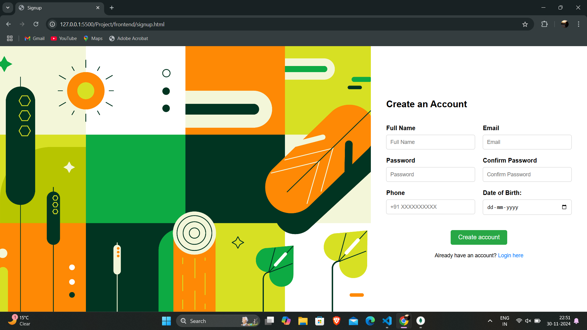
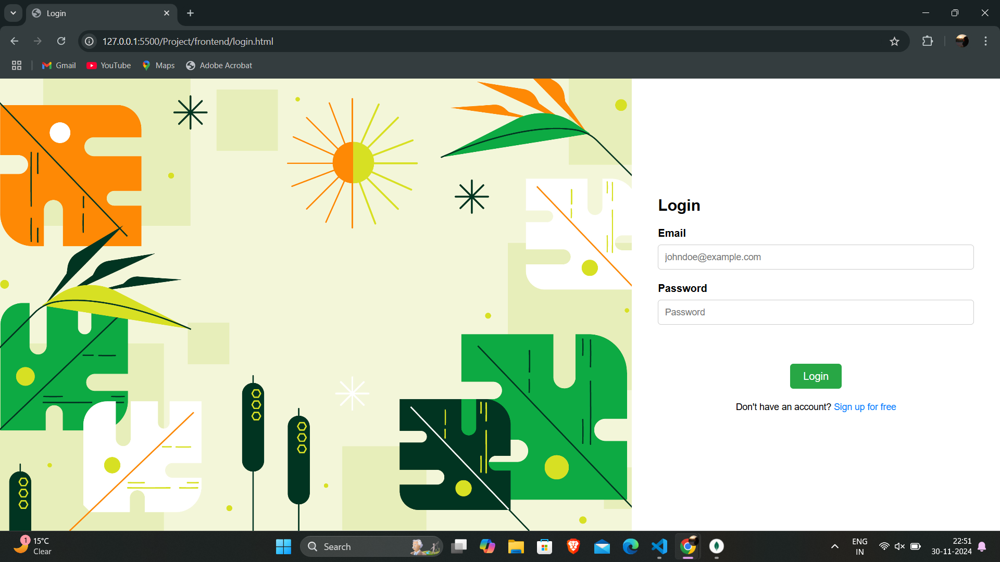

# Signup Page Project

This is a simple **Signup Page** project built using **HTML**, **CSS**, **JavaScript**, and **Node.js** (with **Express** and **MongoDB** for backend). It allows users to create an account by providing their **name**, **email**, **password**, **phone number**, and **date of birth**. The project includes frontend and backend components for handling user registration, authentication, and data validation.

## Features

- **Frontend**: 
  - User-friendly registration form with real-time validation.
  - Validation for required fields and email format.

- **Backend**: 
  - API endpoints to handle user registration.
  - User password encryption using **bcrypt**.
  - MongoDB database to store user data securely.

## Tech Stack

- **Frontend**: 
  - HTML, CSS, JavaScript
  - Bootstrap (for styling, optional)
  
- **Backend**:
  - Node.js
  - Express.js
  - MongoDB
  - bcrypt (for password hashing)
  
- **Environment**: 
  - .env file to manage sensitive information such as database URI and port

## Installation

### Prerequisites

- **Node.js** and **npm** installed.
- **MongoDB** installed locally or use a cloud-based MongoDB service like MongoDB Atlas

### Steps

1. **Clone the repository**:
```bash
   git clone https://github.com/Vaishali1830/Signup-Page
```

2. **Navigate to the project directory**:
```bash
cd signup-page
```

3. **Install dependencies**:
In both the frontend and backend directories, run:
```bash
npm install
```
4. **Set up environment variables**:
Create a .env file in the backend folder and add the following (replace values with your actual configuration):
```bash
PORT=PORT_NO
DB_URL=DATABASE_URL
```

5. **Start the server**:
Run the following command from the backend folder to start the server:
```bash
node server.js
```

6. Run the frontend

### Usage

* Open the project in a web browser.
* Fill in the Signup Form with required details (Full Name, Email,Password, Phone Number, Date of Birth).
* Click the Signup button to submit the form.
* The backend will process the form data, validate inputs, hash the password, and store the user in the MongoDB database.
* Upon successful signup, users are redirected to the login page (and a success message will be displayed).

### Acknowledgments
* MongoDB for storing user data securely.
* bcrypt for password encryption.
* Express for building the backend server.
* HTML/CSS/JavaScript for creating the frontend.

**SIGNUP PAGE**


**LOGIN PAGE**


